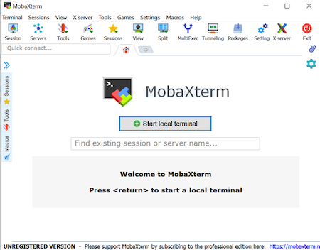
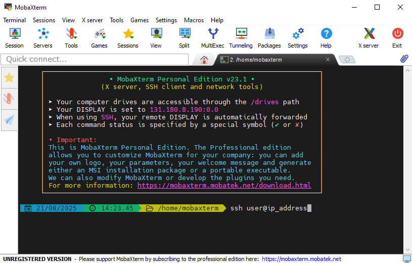

# Logging onto Cloud  

**questions:**  

- How do I connect to the Amazon cloud instance?

**objectives:**  

- Log onto to a running instance
- Log off from a running instance

**keypoints:**  

- You will use provided credentials for all instances
- Logging off an instance is not the same as turning off an instance


<script language="javascript" type="text/javascript">
function set_page_view_defaults() {
    document.getElementById('div_aws_win').style.display = 'block';
    document.getElementById('div_aws_unix').style.display = 'none';
};

function change_content_by_platform(form_control){
    if (!form_control || document.getElementById(form_control).value == 'aws_win') {
        set_page_view_defaults();
    } else if (document.getElementById(form_control).value == 'aws_unix') {
        document.getElementById('div_aws_win').style.display = 'none';
        document.getElementById('div_aws_unix').style.display = 'block';
        document.getElementById('div_hpc').style.display = 'none';
        document.getElementById('div_cyverse').style.display = 'none';
    } else {
        alert("Error: Missing platform value for 'change_content_by_platform()' script!");
    }
}

window.onload = set_page_view_defaults;
</script>

## Important Note

This lesson covers how to log into, and out of, an already running Amazon cloud instance.

## Background to AWS

Setting up a new AWS instance requires a credit card and an AWS account. To save time, your instructor launched a remote computer (instance) for you prior to the workshop, and connected it to our lesson data.  

To access the pre-configured workshop data, you’ll need to use our log-in credentials (user name and password). These credentials will be supplied by your instructor.

But first, you need a place to log into! To find the instance that’s attached to that data, you’ll need something called an IP address. Your instructor should have given this to you at the beginning of the workshop.  

An IP address is essentially the numerical version of a web address like [www.amazon.com](https://www.amazon.com)  

Recall that cloud computing is about choice. You can rent just a single processor on a large computer for a small project, or you can rent hundreds of processors spread across multiple computers for a large project. In either case, once you rent the collection of processors, Amazon will present your rental to you as if it was a single computer. So, the physical computers that host your instances don’t really move, but every time you launch a new instance, it will have a new IP address.  

## Connection Protocols

We will use a protocol called Secure Shell (SSH) that, as the name implies, provides you
with a secure way to use a shell. In our case,
the shell will be running on a remote machine. This protocol is available for every
operating system, but sometimes requires additional software.

## Logging onto a cloud instance

**Please select the platform you wish to use for the exercises: <select id="id_platform" name="platformlist" onchange="change_content_by_platform('id_platform');return false;"><option value="aws_unix" id="id_aws_unix" selected> AWS_UNIX </option><option value="aws_win" id="id_aws_win" selected> AWS_Windows </option></select>**


<div id="div_aws_win" style="display:block" markdown="1">

#### Connecting using PC

*Prerequisites*: You must have an SSH client. There are several free options but you should have installed [MobaXterm](https://mobaxterm.mobatek.net/download-home-edition.html) at the begining of the workshop, and we're going to continue using that.


1. Open MobaXterm

2. Click "Start local terminal” in the middle of the MobaXterm screen

    

3. Type the following command substituting ip_address by the IP address your instructor will provide:

    

    *Be sure to pay attention to capitalization and spaces*

4. You will receive a security message that looks something like the message below:

    ```text
    The authenticity of host '3.70.236.93 (3.70.236.93)' can't be established.
    ECDSA key fingerprint is 1c:24:7c:8b:3c:f9:34:d5:25:02:8a:a6:1b:11:ea:5a.
    Are you sure you want to continue connecting (yes/no)?
    ```

5. Type `yes` to proceed

6. In the final step, you will be asked to provide a password
    
    **Note:** When typing your password, it is common in Unix/Linux not see any asterisks (e.g. `****`) or moving cursors. Just continue typing.

You should now be connected!

</div>


<div id="div_aws_unix" style="display:block" markdown="1">


#### Connecting using Mac/Linux

Mac and Linux operating systems will already have terminals installed. 

1. Open the terminal

    Simply search for 'Terminal' and/or look for the terminal icon

    

2. Type the following command substituting ip_address by the IP address your instructor will provide:

    ```bash
    $ ssh user@ip_address
    ```

    *Be sure to pay attention to capitalization and spaces*

3. You will receive a security message that looks something like the message below

     ```text
    The authenticity of host '3.70.236.93 (3.70.236.93)' can't be established.
    ECDSA key fingerprint is 1c:24:7c:8b:3c:f9:34:d5:25:02:8a:a6:1b:11:ea:5a.
    Are you sure you want to continue connecting (yes/no)?
    ```

4. Type `yes` to proceed
5. In the final step, you will be asked to provide a login and password
    
    **Note:** When typing your password, it is common in Unix/Linux not see any asterisks (e.g. `****`) or moving cursors. Just continue typing.

You should now be connected!

</div>

## Logging off a cloud instance

Logging off your instance is a lot like logging out of your local computer: it stops any processes
that are currently running, but doesn't shut the computer off.

To log off the AWS instance, type `exit`. This will close the connection, and your terminal will go back to showing your local computer.:

```bash
user@3.70.236.93:~$ exit
logout
Connection to 3.70.236.93 closed.
-bash-4.1$
```

## Logging back in

Internet connections can be slow or unstable. If you're just browsing the internet, that means you have reload pages, or wait for pictures to load. When you're working in cloud, that means you'll sometimes be suddenly disconnected from your instance when you weren't expecting it. Even on the best internet connections, your signal will occasionally drop, so it's good to know the above SSH steps, and be able to log into the cloud environment without looking up the instructions each time.
