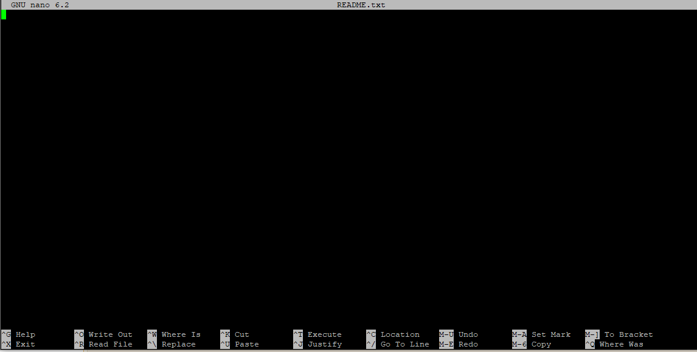

# Writing Scripts and Working with Data

**questions:**
- How can we automate a commonly used set of commands?
objectives:
- Use the **`nano`** text editor to modify text files.
- Write a basic shell script.
- Use the **`bash`** command to execute a shell script.
- Use **`chmod`** to make a script an executable program.

**keypoints:**
- Scripts are a collection of commands executed together.
- Transferring information to and from virtual and local computers.

<script language="javascript" type="text/javascript">
function set_page_view_defaults() {
    document.getElementById('div_win').style.display = 'block';
    document.getElementById('div_unix').style.display = 'none';
};

function change_content_by_platform(form_control){
    if (!form_control || document.getElementById(form_control).value == 'win') {
        set_page_view_defaults();
    } else if (document.getElementById(form_control).value == 'unix') {
        document.getElementById('div_win').style.display = 'none';
        document.getElementById('div_unix').style.display = 'block';
    } else {
        alert("Error: Missing platform value for 'change_content_by_platform()' script!");
    }
}

window.onload = set_page_view_defaults;
</script>


## Writing files

We've been able to do a lot of work with files that already exist, but what if we want to write our own files? We're not going to type in a FASTA file, but we'll see as we go through other tutorials, there are a lot of reasons we'll want to write a file, or edit an existing file.

To add text to files, we're going to use a text editor called Nano. We're going to create a file to take notes about what we've been doing with the data files in **`~/shell_data/untrimmed_fastq`**.

This is good practice when working in bioinformatics. We can create a file called **`README.txt`** that describes the data files in the directory or documents how the files in that directory were generated.  As the name suggests, it's a file that we or others should read to understand the information in that directory.

Let's change our working directory to **`~/shell_data/untrimmed_fastq`** using **`cd`**,
then run **`nano`** to create a file called **`README.txt`**:

```bash
$ cd ~/shell_data/untrimmed_fastq
$ nano README.txt
```

You should see something like this: 



The text at the bottom of the screen shows the keyboard shortcuts for performing various tasks in **`nano`**. We will talk more about how to interpret this information soon.

> ## Which Editor?
>
> When we say, "**`nano`** is a text editor," we really do mean "text": it can
> only work with plain character data, not tables, images, or any other
> human-friendly media. We use it in examples because it is one of the 
> least complex text editors. However, because of this trait, it may 
> not be powerful enough or flexible enough for the work you need to do
> after this workshop. On Unix systems (such as Linux and Mac OS X),
> many programmers use [Emacs](http://www.gnu.org/software/emacs/) or
> [Vim](http://www.vim.org/) (both of which require more time to learn), 
> or a graphical editor such as
> [Gedit](http://projects.gnome.org/gedit/). On Windows, you may wish to
> use [Notepad++](http://notepad-plus-plus.org/).  Windows also has a built-in
> editor called `notepad` that can be run from the command line in the same
> way as `nano` for the purposes of this lesson.  
>
> No matter what editor you use, you will need to know where it searches
> for and saves files. If you start it from the shell, it will (probably)
> use your current working directory as its default location. If you use
> your computer's start menu, it may want to save files in your desktop or
> documents directory instead. You can change this by navigating to
> another directory the first time you "Save As..."

Let's type in a few lines of text. Describe what the files in this
directory are or what you've been doing with them.
Once we're happy with our text, we can press **Ctrl**-**O** (press the **Ctrl** or **Control** key and, while
holding it down, press the **O** key) to write our data to disk. You'll be asked what file we want to save this to:
press **Return** to accept the suggested default of **`README.txt`**.

Once our file is saved, we can use **Ctrl**-**X** to quit the editor and
return to the shell.

> ## Control, Ctrl, or ^ Key
>
> The Control key is also called the "Ctrl" key. There are various ways
> in which using the Control key may be described. For example, you may
> see an instruction to press the **Ctrl** key and, while holding it down,
> press the **X** key, described as any of:
>
> * `Control-X`
> * `Control+X`
> * `Ctrl-X`
> * `Ctrl+X`
> * `^X`
> * `C-x`
>
> In **`nano`**, along the bottom of the screen you'll see **`^G Get Help ^O WriteOut`**.
> This means that you can use **Ctrl**-**G** to get help and **Ctrl**-**O** to save your
> file.

Now you've written a file. You can take a look at it with **`less`** or **`cat`**, or open it up again and edit it with **`nano`**.

> ## Exercise
>
> Open **`README.txt`** and add the date to the top of the file and save the file. 
>
> > ## Solution
> > 
> > Use **`nano README.txt`** to open the file.  
> > Add today's date and then use **Ctrl**-**X** followed by **`y`** and **Enter** to save.
> >
>

## Writing scripts

A really powerful thing about the command line is that you can write scripts. Scripts let you save commands to run them and also lets you put multiple commands together. Though writing scripts may require an additional time investment initially, this can save you time as you run them repeatedly. Scripts can also address the challenge of reproducibility: if you need to repeat an analysis, you retain a record of your command history within the script.

One thing we will commonly want to do with sequencing results is pull out bad reads and write them to a file to see if we can figure out what's going on with them. We're going to look for reads with long sequences of N's like we did before, but now we're going to write a script, so we can run it each time we get new sequences, rather than type the code in by hand each time.

We're going to create a new file to put this command in. We'll call it **`bad-reads-script.sh`**. The **`sh`** isn't required, but using that extension tells us that it's a shell script.

```bash
$ nano bad-reads-script.sh
```

Bad reads have a lot of N's, so we're going to look for  **`NNNNNNNNNN`** with **`grep`**. We want the whole FASTQ record, so we're also going to get the one line above the sequence and the two lines below. We also want to look in all the files that end with **`.fastq`**, so we're going to use the **`*`** wildcard.

```bash
grep -B1 -A2 NNNNNNNNNN *.fastq > scripted_bad_reads.txt
```

Type your **`grep`** command into the file and save it as before. Be careful that you did not add the **`$`** at the beginning of the line.

Now comes the neat part. We can run this script. Type:

```bash
$ bash bad-reads-script.sh
```

It will look like nothing happened, but now if you look at **`scripted_bad_reads.txt`**, you can see that there are now reads in the file.


> ## Exercise
>
> We want the script to tell us when it's done.  
> 1. Open **`bad-reads-script.sh`** and add the line **`echo "Script finished!"`** after the **`grep`** command and save the file.  
> 2. Run the updated script.
>
> > ## Solution
> > 
> >   ```bash
> >   $ bash bad-reads-script.sh
> >   Script finished!
> >   ```
> >
>

## Making the script into a program

We had to type **`bash`** because we needed to tell the computer what program to use to run this script. Instead, we can turn this script into its own program. We need to tell it that it's a program by making it executable. We can do this by changing the file permissions. We talked about permissions earlier.

First, let's look at the current permissions.

```bash
$ ls -l bad-reads-script.sh
```

```output
-rw-rw-r-- 1 user user 81 Oct 25 21:46 bad-reads-script.sh
```

We see that it says **`-rw-rw-r--`**. This shows that the file can be read by any user and written to by the file owner (you) and users that belong to the group called user. We want to change these permissions so that the file can be executed as a program. We use the command **`chmod`** like we did earlier when we removed write permissions. Here we are adding **(`+`)** executable permissions **(`+x`)**.

```bash
$ chmod +x bad-reads-script.sh
```

Now let's look at the permissions again.

```bash
$ ls -l bad-reads-script.sh
```

```output
-rwxrwxr-x 1 user user 81 Oct 25 21:46 bad-reads-script.sh
```

Now we see that it says **`-rwxrwxr-x`**. The **`x`** 's that are there now tell us we can run it as a program. So, let's try it! We'll need to put **`./`** at the beginning so the computer knows to look here in this directory for the program.

```bash
$ ./bad-reads-script.sh
```

The script should run the same way as before, but now we've created our very own computer program!

## Moving and Downloading Data

So far, we've worked with data that is pre-loaded on the instance in the cloud. Usually, however,
most analyses begin with moving data onto the instance. Below we'll show you some commands to 
download data onto your instance, or to move data between your computer and the cloud.

### Getting data from the cloud

There are two programs that will download data from a remote server to your local
(or remote) machine: **``wget``** and **``curl``**. They were designed to do slightly different
tasks by default, so you'll need to give the programs somewhat different options to get
the same behaviour, but they are mostly interchangeable.

 - **``wget``** is short for "world wide web get", and it's basic function is to *download*
 web pages or data at a web address.

 - **``cURL``** is a pun, it is supposed to be read as "see URL", so its basic function is
 to *display* webpages or data at a web address.

Which one you need to use mostly depends on your operating system, as most computers will
only have one or the other installed by default.

Let's say you want to download some data from Ensembl. We're going to download a very small
tab-delimited file that just tells us what data is available on the Ensembl bacteria server.
Before we can start our download, we need to know whether we're using **``curl``** or **``wget``**.

To see which program you have, type:
 
```bash
$ which curl
$ which wget
```

**``which``** is a BASH program that looks through everything you have
installed, and tells you what folder it is installed to. If it can't
find the program you asked for, it returns nothing, i.e. gives you no
results.

On Mac OSX, you'll likely get the following output:

```bash
$ which curl
```

```output
/usr/bin/curl
```

```bash
$ which wget
```

```output
$
```

This output means that you have ``curl`` installed, but not ``wget``.

Once you know whether you have ``curl`` or ``wget``, use one of the
following commands to download the file:

```bash
$ cd
$ wget ftp://ftp.ensemblgenomes.org/pub/release-37/bacteria/species_EnsemblBacteria.txt
```

or

```bash
$ cd
$ curl -O ftp://ftp.ensemblgenomes.org/pub/release-37/bacteria/species_EnsemblBacteria.txt
```

Since we wanted to *download* the file rather than just view it, we used ``wget`` without
any modifiers. With ``curl`` however, we had to use the -O flag, which simultaneously tells ``curl`` to
download the page instead of showing it to us **and** specifies that it should save the
file using the same name it had on the server: species_EnsemblBacteria.txt

It's important to note that both ``curl`` and ``wget`` download to the computer that the
command line belongs to. So, if you are logged into AWS on the command line and execute
the ``curl`` command above in the AWS terminal, the file will be downloaded to your AWS
machine, not your local one.

### Moving files between your laptop and your instance

What if the data you need is on your local computer, but you need to get it *into* the
cloud? There are also several ways to do this, but it's *always* easier
to start the transfer locally. **This means if you're typing into a terminal, the terminal
should not be logged into your instance, it should be showing your local computer. If you're
using a transfer program, it needs to be installed on your local machine, not your instance.**

## Transferring Data Between your Local Machine and the Cloud

These directions are platform specific, so please follow the instructions for your system:

**Please select the platform you wish to use for the exercises: <select id="id_platform" name="platformlist" onchange="change_content_by_platform('id_platform');return false;"><option value="unix" id="id_unix" selected> UNIX </option><option value="win" id="id_win" selected> Windows </option></select>**


<div id="div_unix" style="display:block" markdown="1">

### Uploading Data to your Virtual Machine with scp

`scp` stands for 'secure copy protocol', and is a widely used UNIX tool for moving files
between computers. The simplest way to use `scp` is to run it in your local terminal,
and use it to copy a single file:

```bash
scp <file I want to move> <where I want to move it>
```

Note that you are always running `scp` locally, but that *doesn't* mean that
you can only move files from your local computer. In order to move a file from your local computer to an AWS instance, the command would look like this:

```bash
$ scp <local file> <AWS instance>
```

To move it back to your local computer, you re-order the `to` and `from` fields:

```bash
$ scp <AWS instance> <local file>
```

#### Uploading Data to your Virtual Machine with scp

Open the terminal and use the `scp` command to upload a file (e.g. local_file.txt) to the user home directory:

```bash
$  scp local_file.txt user@ip.address:/home/user/
```

#### Downloading Data from your Virtual Machine with scp

Let's download a text file from our remote machine. You should have a file that contains bad reads called ~/shell_data/scripted_bad_reads.txt.

**Tip:** If you are looking for another (or any really) text file in your home directory to use instead, try:

```bash
$ find ~/shell_data -name *.txt
```


Download the bad reads file in ~/shell_data/scripted_bad_reads.txt to your home ~/Download directory using the following command **(make sure you substitute user@ip.address with your remote login credentials)**:

```bash
$ scp user@ip.address:/home/user/shell_data/untrimmed_fastq/scripted_bad_reads.txt ~/Downloads
```

Remember that in both instances, the command is run from your local machine, we've just flipped the order of the to and from parts of the command.
</div>


<div id="div_win" style="display:block" markdown="1">

### Uploading Data to your Virtual Machine with scp

`scp` stands for 'secure copy protocol', and is a widely used UNIX tool for moving files
between computers. The simplest way to use `scp` is to run it in your local terminal,
and use it to copy a single file:

```bash
scp <file I want to move> <where I want to move it>
```

Note that you are always running `scp` locally, but that *doesn't* mean that
you can only move files from your local computer. In order to move a file from your local computer to an AWS instance, the command would look like this:

```bash
$ scp <local file> <AWS instance>
```

To move it back to your local computer, you re-order the `to` and `from` fields:

```bash
$ scp <AWS instance> <local file>
```

#### Uploading Data to your Virtual Machine with scp

Open the terminal and use the `scp` command to upload a file (e.g. local_file.txt) to the user home directory:

```bash
$  scp local_file.txt user@ip.address:/home/user/
```

#### Downloading Data from your Virtual Machine with scp

Let's download a text file from our remote machine. You should have a file that contains bad reads called ~/shell_data/scripted_bad_reads.txt.

**Tip:** If you are looking for another (or any really) text file in your home directory to use instead, try:

```bash
$ find ~/shell_data -name *.txt
```


Download the bad reads file in ~/shell_data/scripted_bad_reads.txt to your home ~/Download directory using the following command **(make sure you substitute user@ip.address with your remote login credentials)**:

```bash
$ scp user@ip.address:/home/user/shell_data/untrimmed_fastq/scripted_bad_reads.txt ~/Desktop
```

Or if that doesn't work:

```bash
$ scp user@ip.address:/home/user/shell_data/untrimmed_fastq/scripted_bad_reads.txt /drives/c/Users/<REPLACE-BY-YOUR-USERNAME>/Desktop
```

Remember that in both instances, the command is run from your local machine, we've just flipped the order of the to and from parts of the command.

</div>

### Up/Down loading Data to/from your Virtual Machine with FileZilla

FileZilla does the same as scp but with a graphical user interface, which makes it more user friendly. And is available for Windows, Linux and MacOS. 

Open FileZilla and connect with your Virtual Machine with the following settings:

Host: sftp://ip.address  
Username: user  
Password: *******  ( Use the password that you used to login on your AWS Cloud instance)

And click "Quickconnect".

Navigate in "Local site" to your Download folder and in the "Remote site: to /home/user/shell_data/untrimmed_fastq. Download the file scripted_bad_reads.txt by selecting the file and do a right-mouse-click on this file. Select "Download" from the menu.


Thanks for joining!!!